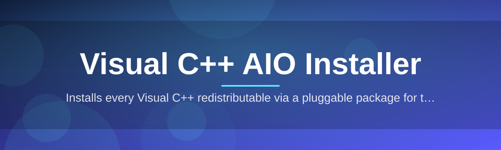

# Visual-C-AIO-Installer-5771 🧩⚡

  

*One installer, every Visual C++ runtime your machine will ever ask for — done in minutes, not tabs.*

  

## 🧠 Overview

If you've ever gone hunting for "vcredist 2015" at 1am because a game or app threw a `MSVCP140.dll is missing` error, you already know the pain this project kills. **Visual-C-AIO-Installer-5771** is an all-in-one Visual C++ redistributable installer that bundles the major runtime versions — from the old 2005/2008 era libraries up through the modern 2015-2026 unified runtime — into a single, offline-capable package. No more opening six browser tabs to Microsoft's download center, no more guessing whether you need x86, x64, or both.

This exists because dependency hell for native Windows applications never really went away — it just got quieter. Game installers, CAD tools, dev environments, and random utility apps all silently expect specific C++ runtime versions to be present, and when they're not, you get a cryptic error code instead of a helpful message. This tool exists to be the boring, reliable fix you run once and forget about.

It's built for solo developers setting up fresh Windows VMs, gamers prepping a new rig, IT folks re-imaging office machines, and anyone who's tired of babysitting redistributable installs one dialog box at a time. If you want a single double-click fix rather than a systems administration lecture, this is for you.

<blockquote>

**Who this is NOT for:** if you need granular control over exact build numbers for compliance reasons, you probably want the individual Microsoft-signed installers instead. This tool optimizes for speed and coverage, not surgical precision.

</blockquote>

---

## 🚀 What It Actually Does

- **Runtime bundling done right** — packs the 2005, 2008, 2010, 2012, 2013, and the unified 2015-2026 Visual C++ redistributables (x86 and x64) into one payload, so you install once instead of six separate times.

- **Silent-mode execution** — every sub-installer runs with quiet flags under the hood, so you're not clicking "Next" through a dozen wizard windows just to get a DLL registered.

- **Smart version detection** — checks what's already installed on the system before touching anything, skipping redundant installs so it doesn't waste your time re-flashing runtimes that are already current.

- **Repair mode** — if a runtime is present but corrupted (a surprisingly common cause of "it worked yesterday" errors), the tool can force a clean repair pass instead of a fresh install.

- **Offline-first design** — once downloaded, the installer doesn't need to phone home to fetch each redistributable separately; everything needed ships in the package.

- **Lightweight footprint** — this is a purpose-built installer, not a bloated toolkit. It does one job — Visual C++ runtime provisioning — and does it fast.

- **Log output for troubleshooting** — generates a readable install log so if something *does* go sideways, you're not debugging blind.

- **No telemetry, no bundled toolbars** — it installs Visual C++ runtimes. That's it. Nothing else rides along.

> [!TIP]
> Run this right after a fresh Windows install, before you install anything else that's native-code heavy (games, IDEs, CAD software). It saves you from chasing missing-DLL errors one app at a time later.

---

## 🏁 Getting Started

1. Hit the download button below and grab the latest package from the landing page.

2. Run the executable — no admin console gymnastics required, just a standard elevation prompt (it needs admin rights to register runtimes system-wide).

3. Let it detect what's missing and choose **Install All** for full coverage, or pick specific runtime versions if you know exactly what you need.

4. Reboot if prompted (rare, but some in-use DLL locks require it) and get back to whatever you were actually trying to do.

> [!NOTE]
> There is no separate "setup wizard" step — the tool is the wizard. You run it, it works, you close it.

---

## 🖥️ System Requirements

| Requirement | Details |
|---|---|
| OS | Windows 10 (64-bit) or Windows 11 |
| Architecture | x86 and x64 supported natively |
| Disk space | ~350 MB free during install (temp extraction) |
| Admin rights | Required — runtimes install system-wide |
| Internet | Not required after initial download — fully offline installer |
| Dependencies | None. Standalone executable, nothing to pre-install |

---

## ⚙️ How It Works

The installer follows a deliberately simple pipeline — detect, decide, deploy, verify. No mystery steps, no hidden network calls.

1. **Scan** the registry and system32 for existing Visual C++ runtime entries across all bundled versions.

2. **Compare** found versions against the bundled payload to build an install plan.

3. **Execute** each needed sub-installer silently, in the correct dependency order (older runtimes first, unified runtime last).

4. **Verify** each install completed by re-checking registry keys, and log the result.

5. **Report** a clean summary — what was installed, what was skipped, what needs a reboot.

> [!IMPORTANT]
> The verify step is not cosmetic — it's what separates this from "just running six installers in a batch script." If a sub-install silently fails, you'll see it in the summary instead of finding out three weeks later.

---

## 🧯 Common Pitfalls

<strong>The installer says a runtime is "already installed" but my app still can't find the DLL.</strong>

This usually means the app needs a specific architecture (x86 vs x64) that isn't the one detected. Run the tool again and force-install both architectures manually from the version picker.

<strong>Windows Defender or SmartScreen flagged the executable.</strong>

This is common for unsigned or newly-published installers bundling multiple third-party payloads. Verify you downloaded from the official landing page linked in this README, then allow it through — the tool itself doesn't modify anything outside standard runtime registration paths.

<strong>Install seems to hang at the "unified runtime" stage.</strong>

This is almost always another process holding a lock on `vcruntime140.dll` or similar. Close browsers, game launchers, and background apps, then re-run. A reboot before installing also clears most stuck handles.

<strong>Do I need to uninstall my existing Visual C++ redistributables first?</strong>

No — the tool detects and repairs in place. Manually uninstalling first can actually break other apps that were relying on those exact runtime versions.

<strong>The log shows a "0x80070666" error on one component.</strong>

That's Windows Installer's way of saying a newer version is already present. It's safe — the installer treats it as a skip, not a failure.

<strong>Can I run this on a locked-down corporate machine?</strong>

You'll need local admin rights regardless of the tool — that's a Windows requirement for runtime registration, not something this installer can work around.

---

## 🎨 UI / UX Details

The interface stays out of your way on purpose — this isn't a dashboard, it's a fast-path utility.

- **Keyboard shortcuts:** `Enter` confirms the current dialog, `Esc` cancels a running step, `Ctrl+L` opens the live log pane.

- **Theme:** Dark mode by default, matching modern Windows 11 aesthetics; a light theme toggle lives in the settings gear icon top-right.

- **Progress clarity:** a per-runtime progress bar plus an overall progress indicator, so you always know what's currently installing versus what's queued.

- **Settings panel:** toggle silent-mode logging verbosity, choose to skip architecture types you don't need, and set whether the tool auto-closes on success.

  

---

## 🤝 Contributing & Community

This started as a personal fix for a recurring headache and grew because other people had the exact same headache. Contributions, bug reports, and version-coverage suggestions are genuinely welcome.

> [!TIP]
> Found a runtime version this installer doesn't cover yet? Open an issue with the exact version string from `Programs and Features` — that's the fastest way to get it added.

- Bug reports: include your Windows build number and the install log output.

- Feature requests: keep them scoped — this tool's whole value is staying lean.

- Pull requests: welcome, especially around silent-install flag accuracy for edge-case runtime versions.

---

## 📜 License

Released under the [MIT License](LICENSE), 2026. Do what you want with it — build on it, fork it, ship it internally, just keep the license notice intact.

---

## ⚠️ Disclaimer

> [!WARNING]
> This tool installs official Microsoft Visual C++ redistributable components. It is an independent packaging/automation project and is not affiliated with, endorsed by, or officially supported by Microsoft. Always download from the official landing page linked in this README to ensure you're getting the intended, unmodified package. Use at your own discretion on production or business-critical systems.

---

